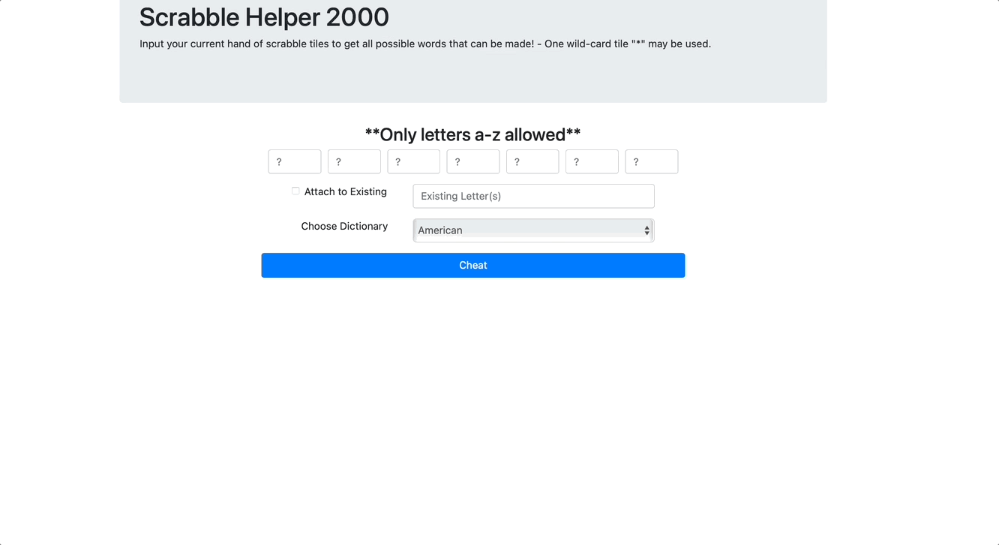

# ScrabbleHelper
This was a project for my internet programming class at Luther College. The project uses the micro web framework Flask along with simple bootstrap for styling. 

I worked with a teammate, Alex Dikelsky, to create an algorithm that matched combinations of letters with dictionary words.
After this first take on it I worked by myself to refactor the project, increase its efficiency, and polish it up. We made this effort together over the course of a morning and afternoon at the Luther College hackathon. Unfortunately, once we finished in the afternoon, I had to leave early for a concert. Alex was able to put together a presentation using the remaining time and present our work at the end of the night.

Up to 7 letters can be input by user. 
All words that can be made using input letters are then returned in an ordered list. 

